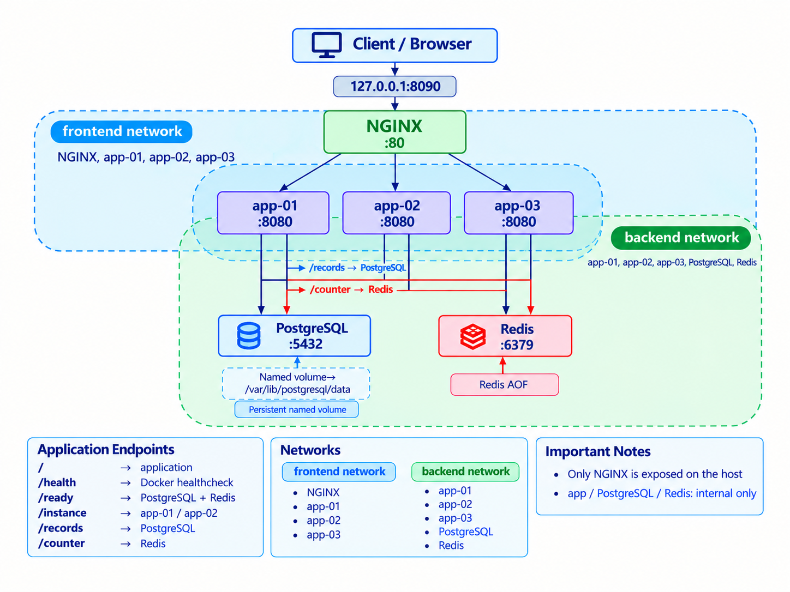

# BARQ Academy – DevOps Assessment

A Docker Compose–based DevOps assessment environment containing:

- NGINX reverse proxy (single public entry point)
- Three Flask application instances (`app-01`, `app-02`, `app-03`)
- PostgreSQL (persistence, named volume)
- Redis (append-only persistence)
- Separated `frontend` / `backend` Docker networks
- Container health checks, readiness endpoints, and restart policies
- CPU and memory resource limits
- Validation, failure/recovery, backup/restore scripts
- GitHub Actions CI workflow

> **Note:** This is a Docker Compose assessment environment. It does not claim production-grade high availability or zero-downtime failover.

---

## Architecture



> *`assets/architecture.png` documents the current Docker Compose topology.*

**Topology summary:**

| Component | Network(s) | Published port |
|-----------|------------|----------------|
| NGINX | `frontend` only | `127.0.0.1:8090` |
| `app-01`, `app-02`, `app-03` | `frontend` + `backend` | None (internal) |
| PostgreSQL | `backend` only | None |
| Redis | `backend` only | None |

NGINX is the only service reachable from the host. Application containers bridge both networks to communicate with NGINX and the data stores. PostgreSQL and Redis are not accessible from NGINX or from the host.

---

## Prerequisites

- Docker
- Docker Compose
- Python 3

---

## Configuration / Secrets

Configuration is supplied via `config/app.env` (local, Git-ignored).

```bash
# Copy the safe template and fill in your values
cp config/app.env.example config/app.env
```

The `BARQ_POSTGRES_PASSWORD` environment variable is required by Compose. Set it in your shell or in `config/app.env`:

```bash
export BARQ_POSTGRES_PASSWORD=<your-local-password>
```

> **Important:** Never commit `config/app.env`. It is ignored by `.gitignore` and excluded from the Docker build context via `.dockerignore`.

---

## Run the Environment

```bash
# Validate Compose configuration (no startup)
docker compose -p barq-assessment config -q

# Build images
docker compose -p barq-assessment build

# Start all services
docker compose -p barq-assessment up -d

# Check service status and health
docker compose -p barq-assessment ps

# View logs
docker compose -p barq-assessment logs --no-color --tail=100

# Stop and remove containers (preserves volumes)
docker compose -p barq-assessment down
```

---

## Application Endpoints

All endpoints are accessed through NGINX at `http://127.0.0.1:8090`.

| Endpoint | Method | Description |
|----------|--------|-------------|
| `/` | GET | Root response; confirms the application is reachable. |
| `/health` | GET | Application liveness check (used by Docker healthcheck). Returns 200 if the app process is alive. |
| `/ready` | GET | Dependency readiness check. Verifies PostgreSQL and Redis connectivity. Returns 200 only when both are reachable. |
| `/instance` | GET | Returns the `INSTANCE_ID` of the responding application container. |
| `/records` | GET / POST | PostgreSQL-backed records endpoint. |
| `/counter` | GET / POST | Redis-backed counter endpoint. |

---

## Validation

```bash
python3 validate.py
```

Performs bounded integration checks against the running environment:

- Public NGINX access on `http://127.0.0.1:8090`
- Application endpoint responses (`/`, `/health`, `/ready`, `/instance`, `/records`, `/counter`)
- PostgreSQL and Redis readiness via `/ready`
- Traffic reaching all three application instances (`app-01`, `app-02`, `app-03`)
- Service health statuses
- Network and port expectations

---

## Failure and Recovery

```bash
python3 failure_test.py
```

The test intentionally stops `app-01` while requests are in flight and then restarts it.

**Observed test result:**

- During the abrupt stop of `app-01`: **15 of 30 requests failed**; the remaining successful requests were served by `app-02`.
- After restarting `app-01`: **40 of 40 requests succeeded**, with both instances available.

> This demonstrates surviving-backend service availability during single-instance failure, but also exposes transient request failures that occur when a backend is abruptly stopped.

> This test was executed before the final `app-03` expansion, when the environment had two application instances (`app-01`, `app-02`). The final runtime was later expanded to three application instances.

---

## Persistence

PostgreSQL data is stored in a named Docker volume mounted at `/var/lib/postgresql/data`.

Redis uses append-only file persistence (`--appendonly yes`).

**Persistence:**

PostgreSQL data survives container recreation via the named volume mounted at `/var/lib/postgresql/data`. This was verified by creating a record, recreating the container, and confirming the record remained available.

**Backup and restore:**

```bash
# Create a backup
./backup.sh

# Restore from a backup file
./restore.sh <backup_file>
```

Backup and restore functionality was verified locally: a backup was created, a subsequent database change was introduced, and then the backup was restored. Inspection confirmed the later change was removed and the original state was successfully restored.

---

## Log Analysis

```bash
python3 analyze_logs.py
```

Parses the three supplied historical log files (`logs/access.log`, `logs/error.log`, `logs/application.log`) and produces a reproducible report covering:

- Request counts, error rates, and status code breakdown
- Exact 5-minute failure buckets
- Latency percentiles (median, p95)
- Upstream retry behaviour
- Incident timeline and correlated examples
- Scope and limitations of the available log data

See `log_analysis.md` for the detailed findings.

---

## CI

The GitHub Actions workflow (`.github/workflows/ci.yml`) performs:

1. **Checkout** – checks out the repository.
2. **Compose validation** – runs `docker compose config -q`.
3. **Build** – builds all images.
4. **Start** – starts the full Compose environment.
5. **Wait** – polls `http://localhost:8090/ready` until it returns HTTP 200.
6. **Validate** – runs `python3 validate.py`.
7. **Cleanup** – runs `docker compose down`.

> The CI workflow validates the Compose configuration and performs an integration-style stack startup within GitHub Actions. It does not claim to prove production readiness.

---

## Troubleshooting and Documentation

| File | Purpose |
|------|---------|
| [`troubleshooting.md`](troubleshooting.md) | Investigation journal: baseline findings, root causes, fixes, and retest evidence |
| [`log_analysis.md`](log_analysis.md) | Answers to the 10 historical log diagnostic questions |
| [`decisions.md`](decisions.md) | Architectural decision records with tradeoffs and limitations |
| [`security_review.md`](security_review.md) | Security controls implemented and remaining production risks |
| [`AI_USAGE.md`](AI_USAGE.md) | AI tools used and human verification responsibilities |

---

## Evidence Index

| Area | Relevant files | Commit | Video evidence |
|------|----------------|--------|----------------|
| Baseline investigation | `troubleshooting.md` | `8442da3` | 00:00–01:50 |
| Application / NGINX fixes | `docker-compose.yml`, `nginx/nginx.conf` | `5c9ca06` | 01:50–03:55 |
| DB / Redis connectivity | `config/app.env` | `5992c22` | 01:50–03:55 |
| Persistence / network isolation | `docker-compose.yml` | `58ae345` | 05:45–07:27 |
| Runtime reliability (restarts, limits) | `docker-compose.yml` | `80d405d` | 01:50–03:55 |
| Security fixes | `Dockerfile`, `docker-compose.yml`, `.gitignore`, `.dockerignore` | `1a1d567` | 01:50–03:55 |
| Validation script | `validate.py` | `4034e2f` | 07:27–10:11 |
| Failure / recovery test | `failure_test.py` | `21e3475` | 03:55–05:45, 07:27–10:11 |
| Backup / restore scripts | `backup.sh`, `restore.sh` | `187c49f` | 05:45–07:27 |
| CI workflow | `.github/workflows/ci.yml` | `c5b5e82` | Final repository state |
| Log analysis | `analyze_logs.py`, `log_analysis.md` | `ed281b7` | 07:27–10:11 |
| Decision records | `decisions.md` | `fcfc037` | Final repository state |
| Security review | `security_review.md` | `e45c7e8` | Final repository state |
| AI usage disclosure | `AI_USAGE.md` | `5f0f654` | Final repository state |
| Video challenge / runtime diagnosis | `video_challenge.sh`, `docker-compose.yml` | Final runtime state | 10:11–12:49 |
| Final runtime: port 8090 + app-03 | `docker-compose.yml`, `nginx/nginx.conf`, `validate.py`, `.github/workflows/ci.yml` | `257b26f` | 12:49–20:49 |
| Final Git verification / push | Git history and repository state | `257b26f` | 20:49–23:35 |
